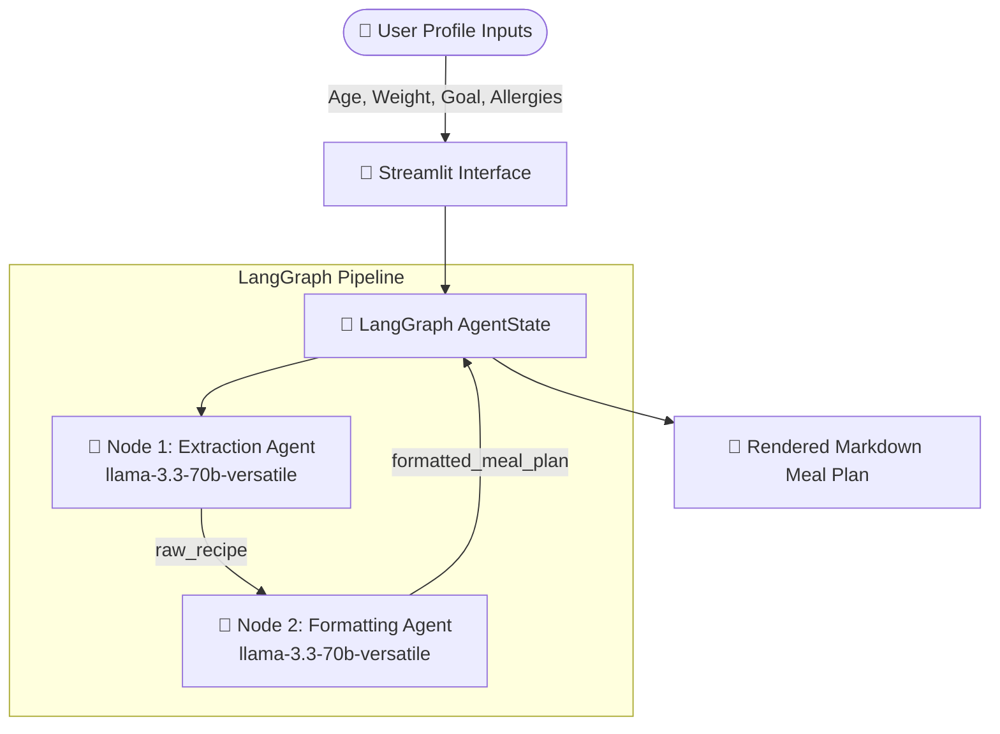

# 🥗 Nutritional AI Agent

[](https://www.python.org/)
[](https://streamlit.io/)
[](https://www.langchain.com/langgraph)
[](https://groq.com/)
[](https://sdgs.un.org/goals/goal3)
[](LICENSE.md)

An **Autonomous Dual-Agent Diet & Nutrition Planner** built with **LangGraph**, **LangChain**, and **Streamlit**, powered by **Groq** (`llama-3.3-70b-versatile`). Aligned with **UN Sustainable Development Goal 3 (Good Health and Well-being)**, this agent empowers users to make sustainable, nutrient-dense lifestyle choices tailored to their specific metabolic parameters.

---

## 🌟 Key Features

- **🤖 Dual-Agent LangGraph Workflow**: Decouples dietary research and metabolic calculation (Extraction Agent) from output structure and presentation (Formatting Agent) for maximum output fidelity.
- **📊 Personalized Metabolic Planning**: Generates customized daily meal recipes based on user **Age**, **Weight**, **Fitness Goals**, and **Dietary Restrictions / Allergies**.
- **🌍 UN SDG 3 Alignment**: Prioritizes whole, nutrient-dense foods to support metabolic health and prevent diet-related chronic conditions.
- **🎨 Modern Glassmorphism UI**: High-contrast, responsive Streamlit user interface styled with custom CSS fonts, emerald gradients, and interactive sidebars.
- **📄 Comprehensive Deliverables & Tooling**: Built-in document generator scripts for producing pitch presentations (`Pitch_Deck.pptx`), project concept notes (`Concept_Note.pdf`), and business canvases (`Lean_Canvas.pdf`).

---

## 🧠 Workflow Architecture

The application uses a stateful multi-agent state graph built on **LangGraph**:



### Agent Roles

1. **Extraction Agent (Node 1)**: Acts as a Clinical Nutritionist and Dietary Researcher. Computes metabolic requirements and formulates customized recipes with ingredient breakdowns and scientific rationale.
2. **Formatting Agent (Node 2)**: Acts as a Senior Technical Writer. Transforms raw research output into structured Markdown featuring macronutrient target summary tables, preparation checklists, step-by-step cooking instructions, and SDG 3 alignment notes.

---

## 📁 Repository Structure

```
nutritional-ai-agent/
├── .streamlit/
│   ├── config.toml               # Streamlit UI theme configuration
│   └── secrets.toml.example      # Streamlit Cloud secrets template
├── docs/                         # Project deliverables & presentations
│   ├── Concept_Note.pdf          # Detailed technical concept document
│   ├── Lean_Canvas.pdf           # Project business model canvas
│   └── Pitch_Deck.pptx           # IBM SkillsBuild submission pitch deck
├── scripts/                      # Utility document generation scripts
│   ├── generate_concept_note.py  # Regenerates docs/Concept_Note.pdf
│   ├── generate_pdf.py           # Regenerates docs/Lean_Canvas.pdf
│   └── generate_pptx.py          # Regenerates docs/Pitch_Deck.pptx
├── src/                          # Modular agent source code
│   ├── __init__.py               # Python package initialization
│   ├── agents.py                 # Extraction & Formatting agent nodes
│   ├── graph.py                  # LangGraph workflow compilation
│   └── state.py                  # AgentState TypedDict memory structure
├── .env.example                  # Environment variable configuration template
├── .gitignore                    # Git file exclusion rules
├── app.py                        # Main Streamlit web application entry point
├── README.md                     # Project documentation
└── requirements.txt              # Python package dependencies
```

---

## 🚀 Quick Start Guide

### Prerequisites

- **Python 3.9+** installed on your system.
- A **Groq Cloud API Key** (Free tier available at [console.groq.com](https://console.groq.com/keys)).

### 1. Clone the Repository

```bash
git clone https://github.com/your-username/nutritional-ai-agent.git
cd nutritional-ai-agent
```

### 2. Set Up Virtual Environment

```bash
# Windows
python -m venv .venv
.venv\Scripts\activate

# macOS / Linux
python3 -m venv .venv
source .venv/bin/activate
```

### 3. Install Dependencies

```bash
pip install -r requirements.txt
```

### 4. Configure Environment Variables

Create a `.env` file in the root directory by copying `.env.example`:

```bash
cp .env.example .env
```

Open `.env` and insert your Groq API Key:

```env
GROQ_API_KEY=gsk_your_actual_groq_api_key_here
```

*(Note: You can also enter your key directly in the Streamlit UI sidebar at runtime).*

### 5. Launch the Application

```bash
streamlit run app.py
```

The app will open automatically in your web browser at `http://localhost:8501`.

---

## 📄 Regenerating Deliverables

If you modify presentation content or document scripts, you can regenerate the PDFs and PowerPoint pitch deck into the `docs/` directory using the provided python scripts:

```bash
# Generate Project Concept Note PDF
python scripts/generate_concept_note.py

# Generate Lean Canvas PDF
python scripts/generate_pdf.py

# Generate IBM Pitch Deck Presentation
python scripts/generate_pptx.py
```

---

## 👥 Authors & Credits

- **Soujanya K Hegde**
- **Mohammed Umar F**

**Institution**: Cambridge Institute of Technology  
**Program**: IBM SkillsBuild Internship Project Submission  
**Theme**: UN Sustainable Development Goal 3 (Good Health and Well-being)

---

## 📜 License

This project is open-source and licensed under the [MIT License](LICENSE).
